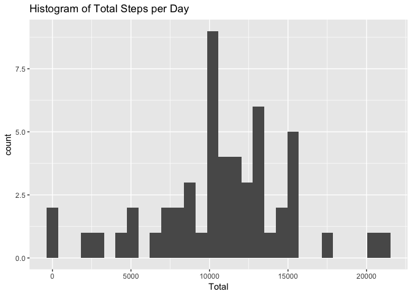
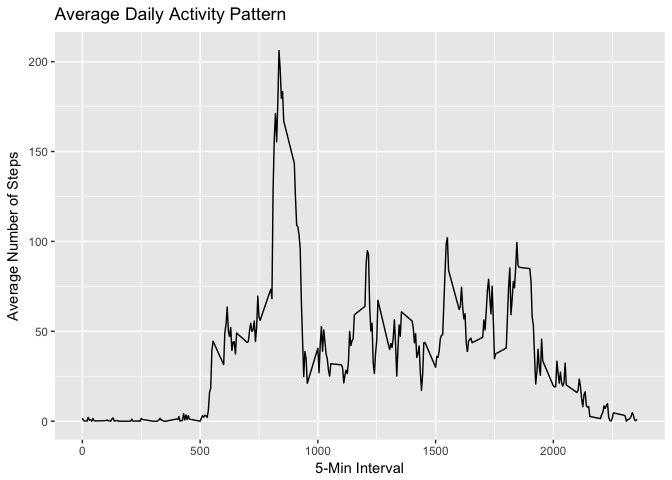
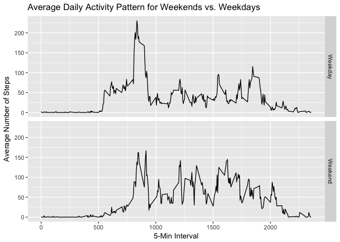

# Course Project 1


## Loading and Preprocessing Data

```r
library(dplyr)
```

```
## Warning: Installed Rcpp (0.12.12) different from Rcpp used to build dplyr (0.12.11).
## Please reinstall dplyr to avoid random crashes or undefined behavior.
```

```
## 
## Attaching package: 'dplyr'
```

```
## The following objects are masked from 'package:stats':
## 
##     filter, lag
```

```
## The following objects are masked from 'package:base':
## 
##     intersect, setdiff, setequal, union
```

```r
library(ggplot2)
activity <- read.csv("activity.csv")
activity$date <- as.Date(activity$date)
```


## Question 1: Mean Steps per Day

```r
#calculate total
total <- sum(activity$steps, na.rm = T) 

#plot histogram of daily total
temp <- group_by(activity, date)
dayTot <- summarize(temp, Total = sum(steps, na.rm = T))
ggplot(dayTot, aes(Total)) + geom_histogram() + ggtitle("Histogram of Total Steps per Day")
```

```
## `stat_bin()` using `bins = 30`. Pick better value with `binwidth`.
```

<!-- -->

```r
#calculate mean daily total and median daily total
meanSteps <- mean(dayTot$Total, na.rm = T)
medSteps <- median(dayTot$Total, na.rm = T)
```
The overall total number of steps is 570608.

The mean total number of steps taken per day is 9354.2295082 steps and the median total number of steps taken per day is 10395 steps.

## Question 2: Average Daily Activity Pattern

```r
temp <- group_by(activity, interval)
dailyAct <- summarize(temp, Average = mean(steps, na.rm = T))
ggplot(dailyAct, aes(y = Average, x = interval)) + geom_line() + 
    xlab("5-Min Interval") + ggtitle("Average Daily Activity Pattern") +
    ylab("Average Number of Steps")
```

<!-- -->

```r
maxInt <- as.integer(dailyAct[which.max(dailyAct$Average),"interval"])
```
The interval 835 contains the maximum number of steps on average across all the days in the dataset.

## Question 3: Imputing Missing Values

```r
nas <- filter(activity, is.na(steps))
numRows <- nrow(nas)

##strategy will be to use the average of a given interval to fill in the missing value
temp <- group_by(activity, interval)
dailyAct <- summarize(temp, Average = mean(steps, na.rm = T))

#fill in missing values
for (i in unique(nas$interval)) nas[nas$interval == i,"steps"] = dailyAct[dailyAct$interval == i, "Average"]

#remove missing values from the base dataset, and then re-add the rows with the new values
activity <- na.omit(activity)
activity <- rbind(activity, nas)

#calculate total steps
newTotal <- sum(activity$steps, na.rm = T) 

#plot histogram of daily total
temp <- group_by(activity, date)
dayTot <- summarize(temp, Total = sum(steps, na.rm = T))
ggplot(dayTot, aes(Total)) + geom_histogram() + ggtitle("Histogram of Total Steps per Day")
```

```
## `stat_bin()` using `bins = 30`. Pick better value with `binwidth`.
```

<!-- -->

```r
#calculate mean daily total and median daily total
newMeanSteps <- mean(dayTot$Total, na.rm = T)
newMedSteps <- median(dayTot$Total, na.rm = T)

dif = newTotal - total
```
The number of rows with missing values is 2304.

The new total number of steps is 6.5673751\times 10^{5} which is 8.6129509\times 10^{4} more steps than the old total number of steps, 570608. 

Also, the new median number of steps per day is 1.0766189\times 10^{4} and the new mean is 1.0766189\times 10^{4} which are both higher than their previous versions. 


```r
## Create a factor variable that splits dates into weekend and weekday
activity$dayType <- "Weekend"
check <- c("Monday", "Tuesday", "Wednesday", "Thursday", "Friday")

activity[weekdays(activity$date) %in% check,"dayType"] <- "Weekday"

activity$dayType <- as.factor(activity$dayType)

#plot Average Daily Activity Pattern differentiated by weekend vs. weekday
temp <- group_by(activity, interval, dayType)
weekCheck <- summarize(temp, Average = mean(steps, na.rm = T))
ggplot(weekCheck, aes(y = Average, x = interval)) + geom_line() + 
    xlab("5-Min Interval") + 
    ggtitle("Average Daily Activity Pattern for Weekends vs. Weekdays") +
    facet_grid(dayType~.) + ylab("Average Number of Steps")
```

<!-- -->
